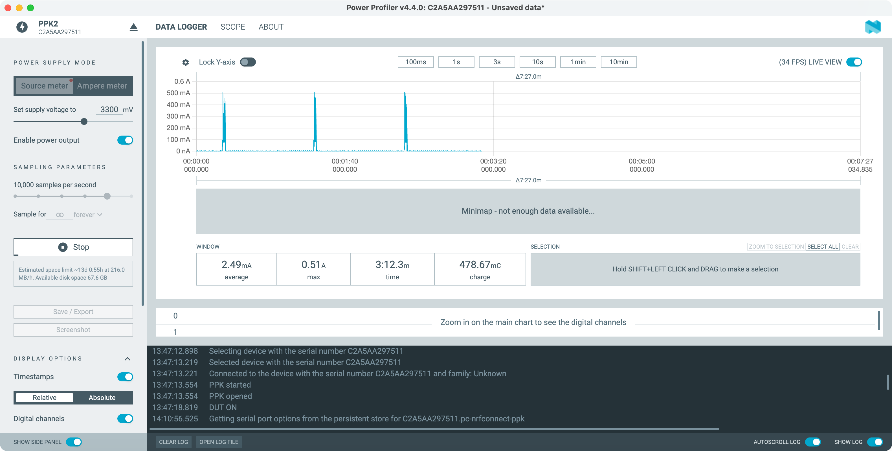
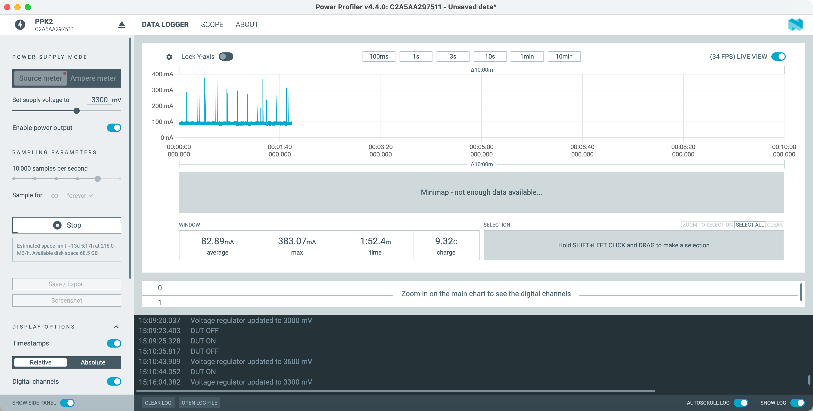
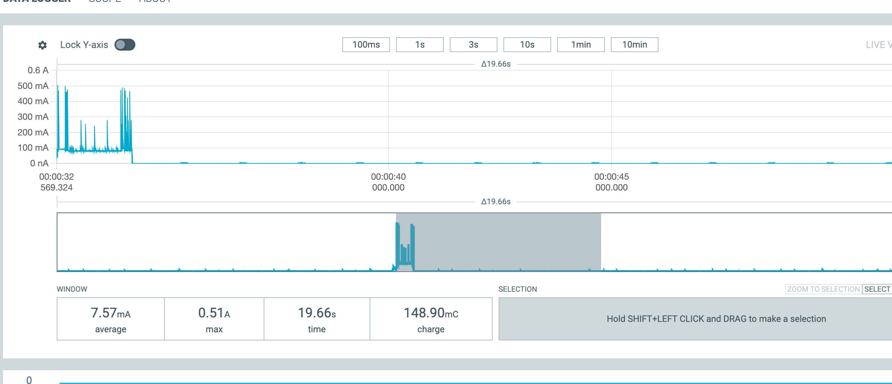
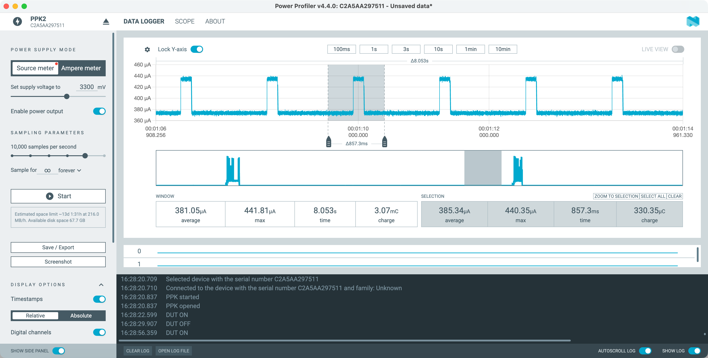
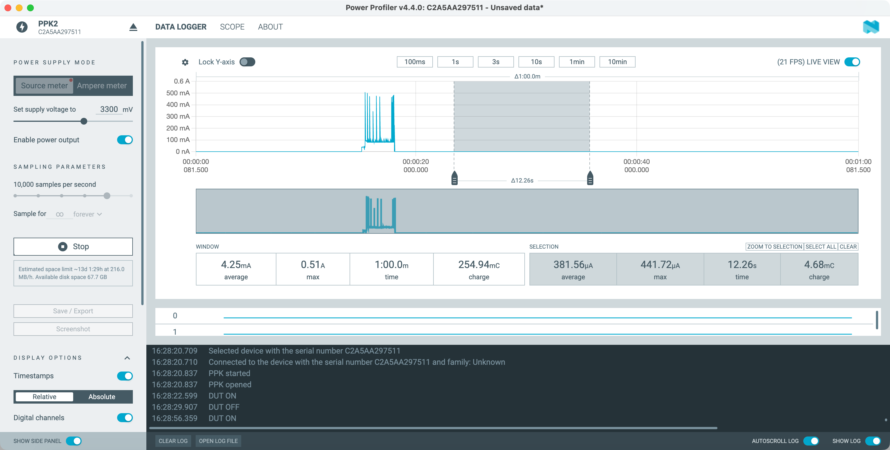
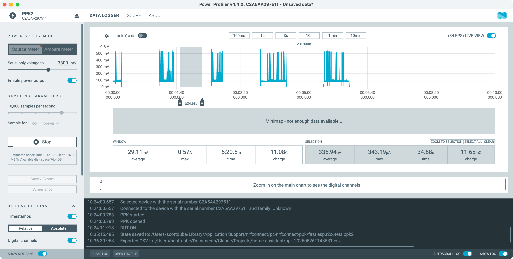
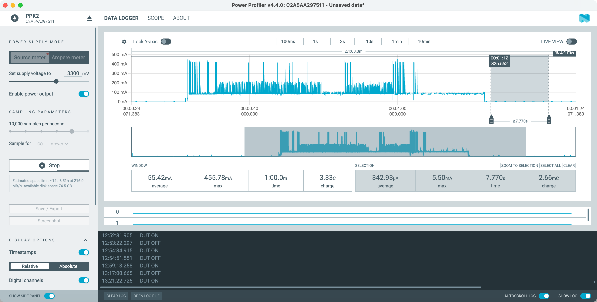
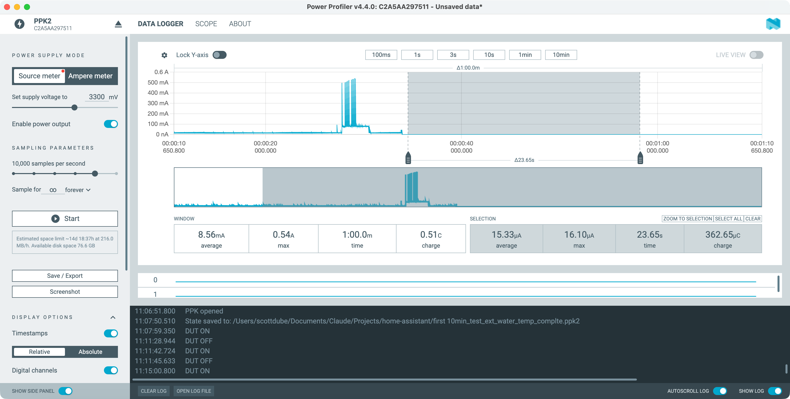
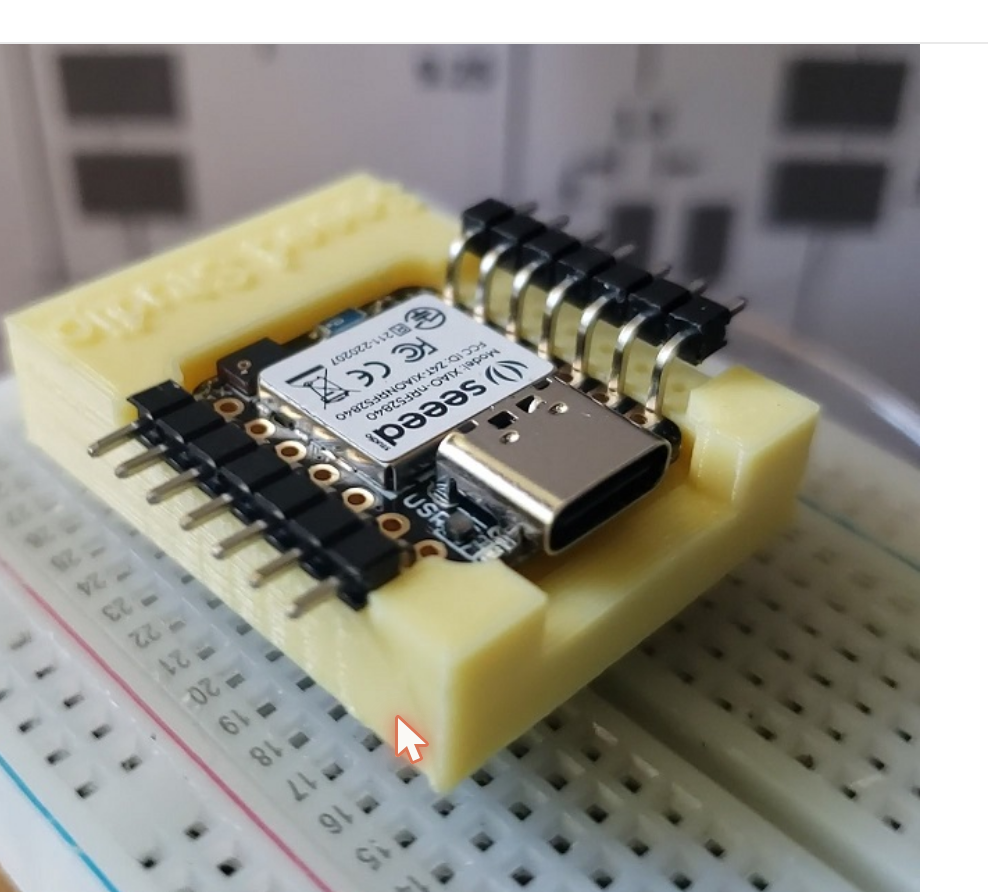
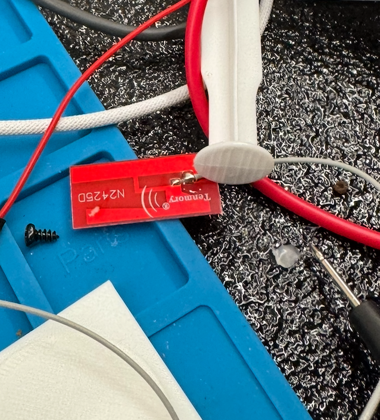

# PPK2 bench session — XIAO ESP32-C6 deployed pool float v2

**Date:** 2026-05-26
**Hardware under test:** Modded XIAO ESP32-C6 from the deployed v2 pool float (NTC on GPIO1, SGM6029 bypassed, U.FL external antenna, regulator bypass via L91 → 3V3 pin, BAT pads unused, dummy NTC's GND-leg in series with the 47 kΩ reference)
**Power source:** Nordic PPK2 in Source Meter mode at 3.300 V, leads on the C6's 3V3 pin and GND (same supply voltage the L91 stack delivers)
**Purpose:** Characterize the deployed float's sleep current behavior, identify the LED-flash phenomenon, validate the `calibrate_linear` battery cal procedure, catch the OTA mode flag deploy gotcha, and confirm 1-min cadence works pre-deployment.

**Related docs:**
- [`docs/decisions/025-pool-float-v2-hardware-revision.md`](decisions/025-pool-float-v2-hardware-revision.md) — Original 2026-05-26 amendment (now superseded in the "Voltage trap confirmed" subsection — see 2026-05-27 amendment correction below it). The findings on calibrate_linear, LED removal, OTA flag gotcha, in-pool RSSI, and bone-dry case all still stand.
- [`docs/ppk2-c6-bench-2026-05-27-bare-board.md`](ppk2-c6-bench-2026-05-27-bare-board.md) — Following day's bench session on a fresh stock C6 that disproved the voltage-trap framing and identified the real root cause.
- [`docs/ppk2-c6-float-bench-2026-05-26.md`](ppk2-c6-float-bench-2026-05-26.md) — Procedure doc for the planned 2026-05-26 PPK2 testing (the script we worked from).

## Methodology

PPK2 in Source Meter mode at 3.300 V powered the modded float through clip leads on the 3V3 pin and GND. The float's L91 stack was removed during testing. Captures span the full session from early morning baseline reads through evening pre-deployment validation. Sleep current is taken from the flat selection between wake events; window-average values include the wake events.

## Canonical captures

### Cadence test — 1-min sleep cycle confirmed

**Window average: 2.49 mA over 3:12.3 m, three wake events visible**

First PPK2 trace after flashing the new firmware with the 2-point `calibrate_linear` battery cal. Confirms the device is waking every ~1 minute on the test cadence and the wake-publish-sleep cycle is working. The relatively low window average (2.49 mA over 3 minutes including 3 wakes at 500 mA peak) is consistent with a healthy duty cycle.

### OTA flag stuck on — device not sleeping

**Window average: 82.89 mA, max 383 mA, no proper sleep floor**

Captured this when the device was drawing ~80 mA continuously instead of sleeping. The `input_boolean.pool_float_ota_mode` HA helper had been left ON after the previous OTA flash, and the firmware's wake script honors it by calling `deep_sleep.prevent`. Clearing the flag via the HA REST API immediately restored normal sleep cycling. Documented in ADR-025's amendment as the OTA workflow gotcha; pre/post-OTA checklist now includes an explicit flag-clear step.

### LED blips identified on the sleep floor

**Window average: 7.57 mA over 19.66 s, periodic blips visible between wake events**

This is the capture where the red charge LED on the modded board flashing pattern first showed up as visible blips on the PPK2 sleep floor. Scott annotated three of the blips with red arrows; they're roughly 2 seconds apart. At this Y-axis zoom they look small but they're additive to whatever the sleep floor's actually doing — the question this raised was whether they were a real contributor to runtime cost. (The 2026-05-27 bench characterization later showed they were not — removing the LED didn't change the average sleep current.)

### Sleep floor zoomed — post-LED-removal characterization

**Selection average: 385.34 µA over 857.3 ms, square-wave oscillation between ~370 and ~440 µA**

The post-LED-removal sleep current at a Y-axis zoom of 360–460 µA, after surgically desoldering the charge LED. The headline finding: sleep current was unchanged from before the LED removal, meaning the LED was visually annoying but contributed essentially nothing to the steady-state floor. The square-wave oscillation visible here was reframed by 2026-05-27 work as the charge IC's STAT pin toggling — independent of the LED itself.

### Sleep floor at wider time scale — same modded board

**Selection average: 381.56 µA over 12.26 s, full wake-to-sleep transition visible**

Same data as the previous capture but with a wider 12-second selection that includes the transition out of the wake event into the sleep floor. The 381.56 µA selection average became the canonical "deployed float sleep current" number cited in the runtime projections.

## Supporting captures (configuration context unclear)

These three early-morning PPK2 traces show the modded float at various PPK2 source voltages or wiring states; the exact configuration of each isn't documented in the session log but they capture the modded board's behavior across what appears to be an exploration phase before the canonical post-OTA work.

The 15.33 µA capture is particularly interesting in hindsight — it matches the bare-board floor identified the next day, suggesting some specific configuration during this session got the modded board down to a healthy ADC-subsystem-free state momentarily. Worth investigating if a future session revisits this.

## Physical setup photos

## Session artifacts

The 23 captures in `_session-artifacts/` are HA Developer Tools entity inspectors, ESPHome compile output, VS Code git diffs, HA chart screenshots, and other context captures from the session that aren't canonical bench evidence but are preserved for future reference. Filenames describe each.

## Conclusions and forward links

The deployed float's 381 µA sleep current measured here is the number the 2026-05-26 ADR-025 amendment originally tried to explain via a "voltage trap below 3.5 V" theory. That framing was [disproved the following day](ppk2-c6-bench-2026-05-27-bare-board.md) and the real root cause (NTC voltage divider + ADC subsystem bias) was identified through the controlled bare-board matrix. The LED-flash diagnosis here was correct (cosmetic, no measurable impact) and stands without amendment.
