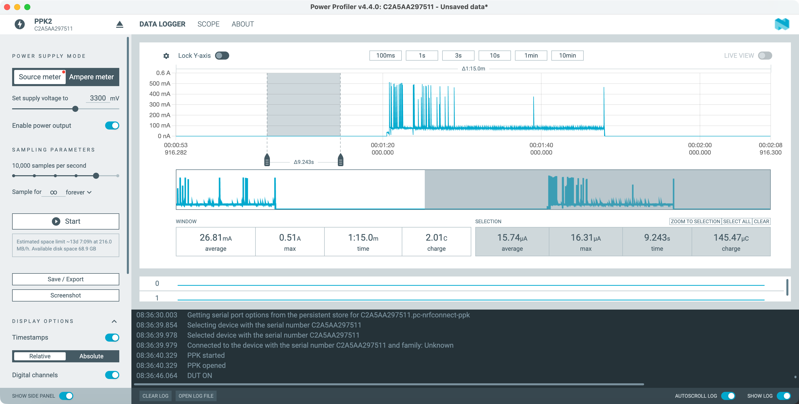
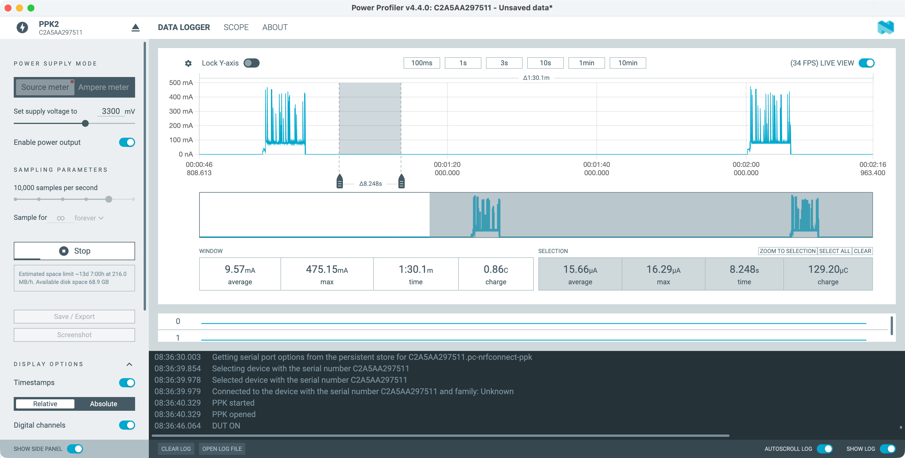
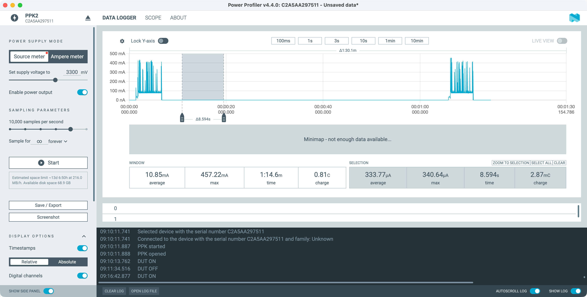
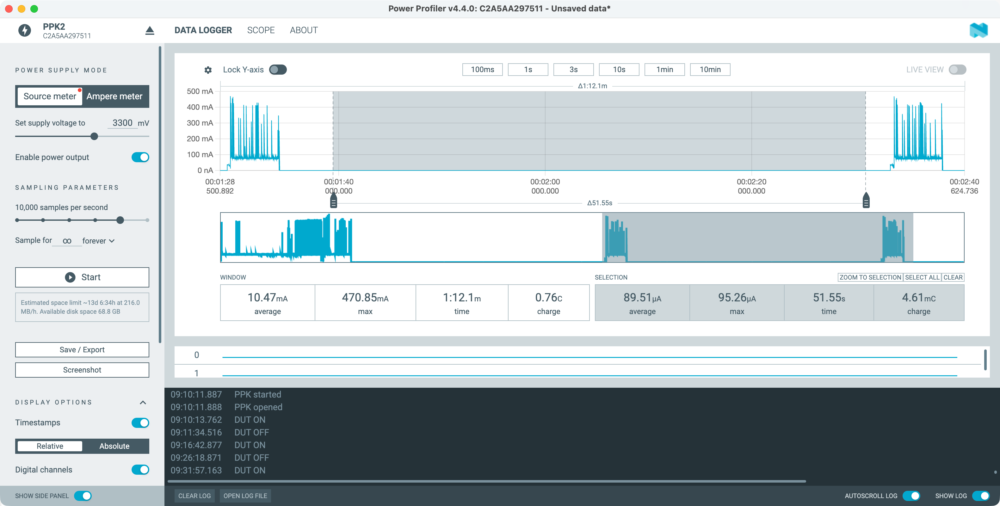
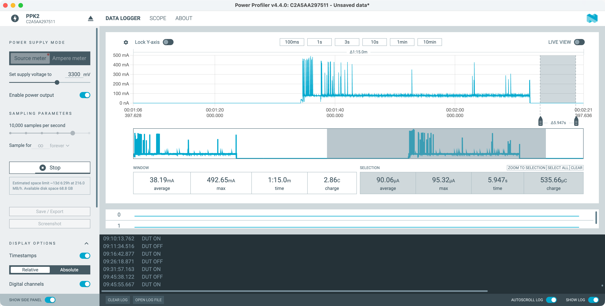
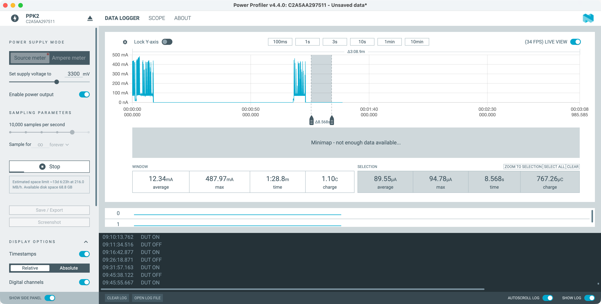
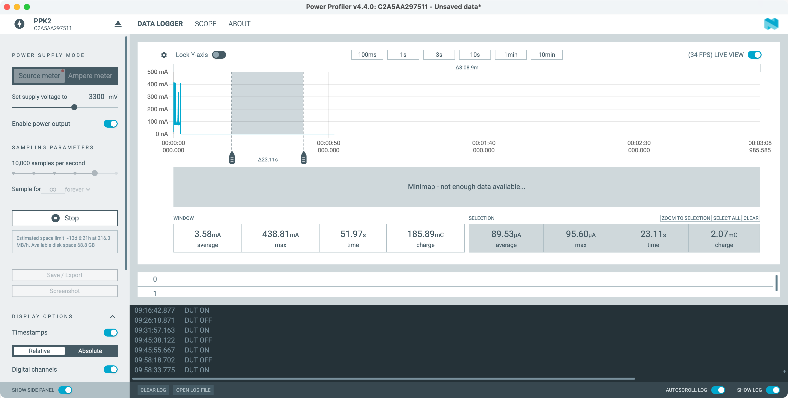
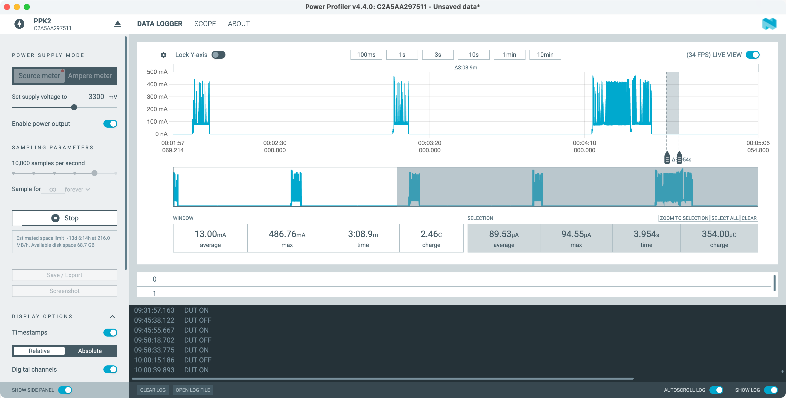

# PPK2 bench session — XIAO ESP32-C6 bare-board characterization

**Date:** 2026-05-27
**Hardware under test:** Fresh stock XIAO ESP32-C6 (no mods, no soldering)
**Power source:** Nordic PPK2 in Source Meter mode at 3.300 V, leads on the C6's 3V3 pin and GND
**Purpose:** Disprove the "voltage trap below 3.5 V" framing from the 2026-05-26 ADR-025 amendment and identify the actual root cause of the deployed float's 381 µA sleep current.

**Related docs:**
- [`docs/decisions/025-pool-float-v2-hardware-revision.md`](decisions/025-pool-float-v2-hardware-revision.md) — Amendment correction section is the canonical writeup of conclusions; this file is the underlying empirical evidence.
- [`docs/ppk2-c6-float-bench-2026-05-26.md`](ppk2-c6-float-bench-2026-05-26.md) — Yesterday's bench session on the deployed modded float (the 381 µA measurement that started this).
- [`esphome/c6-bare-power-test.yaml`](../esphome/c6-bare-power-test.yaml) — Bench firmware that drove the controlled tests below.

## Methodology

One variable per test. Each capture below changes exactly one thing from the capture above. Sleep-current values are taken from a flat 8–30 s "selection" of the PPK2 trace between wake events, not the wake-event-inclusive window average. Source voltage held at 3.300 V throughout to match the deployed float's L91-stack supply.

## Bench setup

Two 47 kΩ resistors on a breadboard, jumpered to the C6's GPIO1 (ADC input) and to either 3V3 / GPIO2 / GND depending on the test below. PPK2 clip leads on the C6's side-castellation 3V3 and GND pins.

## Captures (chronological)

### 1. Bare board, minimal firmware

**Sleep current: 15.74 µA**

The baseline. Stock C6, `c6-bare-power-test.yaml` firmware in its minimal form — uptime + wifi_signal sensors only, no ADC sensors declared. This single measurement disproves the "voltage trap below 3.5 V" theory immediately. A fresh C6 powered via 3V3 pin at 3.3 V hits the Seeed forum's 15 µA reference cleanly, with no modifications.

### 2. Bare board + full pool-float firmware (ADCs configured, nothing wired)

**Sleep current: 15.66 µA**

Same physical board, OTA-flashed with the full pool float v2 firmware — ADC sensors on GPIO0 and GPIO1 declared in YAML, RF switch enable lambda in `on_boot` priority 800, all the modded-float code paths active. Nothing physically wired to any GPIO. Firmware alone adds zero measurable cost. Proves the modded float's high sleep current is not caused by firmware logic.

### 3. Add NTC voltage divider, high side on 3V3

**Sleep current: 333.77 µA**

Two 47 kΩ resistors in series between 3V3 → GPIO1 → GND on the breadboard. GPIO1 is configured as an ADC input at 12 dB attenuation per the pool float firmware. Passive Ohm's law predicts 3.3 V ÷ 94 kΩ = 35 µA. Observed delta from the baseline is 318 µA — roughly 10× the prediction. This is the dominant cost of the deployed float's sleep current.

### 4. Move divider's high side to GPIO2 (gated)

**Sleep current: 89.51 µA**

Same divider, but the 47 kΩ reference resistor's high side is now connected to GPIO2 instead of 3V3. Firmware drives GPIO2 HIGH in an `on_boot` priority-800 lambda (so the divider is powered while the ADC samples), then LOW with `gpio_hold_en` immediately before `deep_sleep.enter` (so the divider sees 0 V on both ends during sleep). Recovers 244 µA — about 73 % of the divider's continuous cost. This is the proven fix for the v2.1 design.

### 5. Dummy NTC's GND leg lifted (pin pulled out of breadboard)

**Sleep current: 90.06 µA**

Same firmware, same GPIO-gated topology, but the second 47 kΩ resistor's GND-side leg is physically lifted out of the breadboard so the divider has no path to ground through the dummy NTC. Sleep current is unchanged within noise. Confirms the 74 µA residual above the bare floor is not current flowing through the divider during sleep.

### 6. GPIO0 ADC sensor removed from firmware

**Sleep current: 89.55 µA**

Re-flashed firmware with the GPIO0 (battery voltage) ADC sensor removed from the YAML. Only one ADC channel declared (GPIO1, the NTC). Same 89 µA result. Confirms the 74 µA residual is not from having multiple ADC channels configured.

### 7. GPIO1 lifted entirely (pin floating)

**Sleep current: 89.53 µA**

Jumper wire between GPIO1 and the breadboard removed. GPIO1 is now floating with no electrical connection to anything. Same 89 µA. Confirms the residual is independent of what's physically connected to the configured ADC pin.

### 8. ADC attenuation changed 12 dB → 6 dB

**Sleep current: 89.53 µA**

YAML edited to switch the ADC's attenuation setting from `12db` to `6db` (full-scale input range drops from ~3.3 V to ~2.2 V). Same 89 µA. Confirms the residual isn't from the 12 dB attenuator network specifically — it's a fixed cost of having any ADC channel configured at all.

## Conclusions

Two independent costs make up the 365 µA delta between a bare stock C6 (15.66 µA) and the deployed modded float (381 µA):

1. **NTC voltage divider continuously powered from 3V3:** ~245 µA. Far above the 35 µA passive Ohm's-law prediction. Best read is the ADC pin's input frontend at 12 dB attenuation is loading the divider via internal bias circuitry the passive math doesn't capture — held loosely, mechanism not directly measured. Eliminated by GPIO-gating the divider's high side (capture 4).

2. **ADC subsystem initialization bias:** ~74 µA. Fixed chip-level cost of having any ADC channel declared in ESP-IDF, independent of channel count, attenuation setting, pin connection state, or pin voltage (captures 5–8). Likely eliminable by calling `adc_oneshot_del_unit()` before deep sleep and re-initializing on wake — untested.

The "voltage trap below 3.5 V" framing from the 2026-05-26 amendment is wrong. There is no inherent voltage trap on this chip at L91-stack supply.

See ADR-025's "Amendment correction — 2026-05-27 bare-board characterization" section for the corrected design narrative and the v2.1 GPIO-gated divider recipe.
